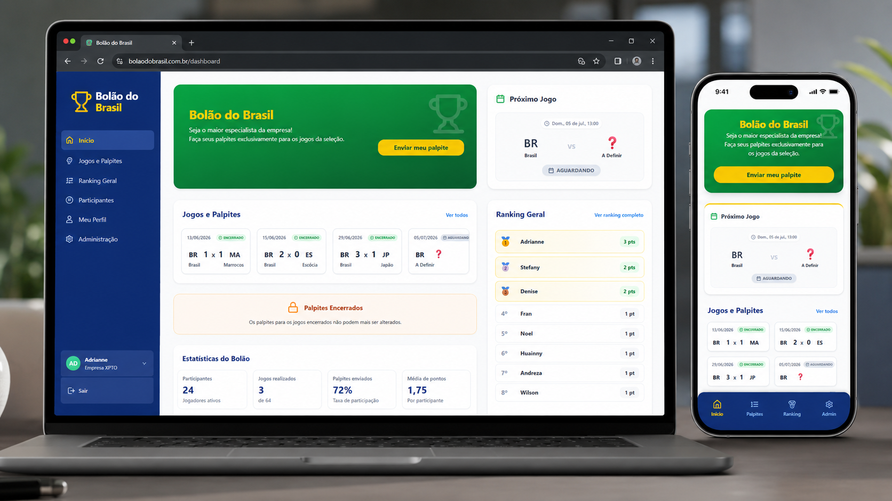

# Bolao UCT

Plataforma web de bolao para centralizar palpites, jogos, placares e ranking com atualizacao confiavel e operacao simples.

[](https://bolaohemo.vercel.app/)
[](#stack)
[](#stack)
[](#visao-geral)



## Visao Geral

O Bolao UCT foi desenvolvido para substituir controles manuais de palpites e ranking por uma plataforma web centralizada, visual e confiavel.

O projeto combina interface moderna, regras de pontuacao, autenticacao administrativa e persistencia de dados, funcionando tanto como aplicacao real quanto como case de portfolio.

## O que o sistema faz

- recebe palpites dos participantes;
- lista jogos e resultados;
- calcula ranking automaticamente;
- disponibiliza painel administrativo;
- permite criar jogos, atualizar placares e gerenciar participantes;
- persiste dados no Supabase;
- publica a aplicacao em producao via Vercel.

## Stack

- React 18
- Vite
- Supabase
- React Router
- Lucide React
- Vercel Functions

## Destaques tecnicos

- integracao com banco relacional via Supabase;
- autenticacao separada para administracao;
- recalculo automatico de ranking;
- suporte a SPA com rotas amigaveis;
- estrutura pronta para evolucao sem reescrita do projeto.

## Como rodar localmente

### Instalacao

```bash
npm install
```

### Variaveis de ambiente

```bash
cp .env.example .env
```

Exemplo:

```env
VITE_SUPABASE_URL=https://seu-projeto.supabase.co
VITE_SUPABASE_ANON_KEY=sua-chave-anonima
VITE_ADMIN_EMAIL=admin@seu-dominio.com
VITE_ADMIN_PASSWORD=sua-senha-apenas-para-desenvolvimento-local

SUPABASE_URL=https://seu-projeto.supabase.co
SUPABASE_SERVICE_ROLE_KEY=sua-chave-service-role
API_FOOTBALL_KEY=sua-chave-api-football
```

### Execucao

```bash
npm run dev
```

O app fica disponivel em `http://localhost:5173`.

## Deploy

O projeto esta preparado para Vercel.

Para simular ambiente da Vercel localmente:

```bash
npm run dev:vercel
```

## Banco de dados

O schema e os seeds ficam em:

- `supabase/migrations/001_initial_schema.sql`
- `supabase/migrations/002_public_access_policies.sql`
- `supabase/migrations/004_admin_auth_policies.sql`
- `supabase/seed.sql`

## Objetivo do projeto

Este projeto faz parte do meu portfolio como exemplo de aplicacao com regras de negocio, ranking em tempo real e area administrativa. Ele foi desenvolvido para demonstrar:

- integracao entre frontend, backend leve e banco;
- modelagem de fluxo com pontuacao;
- autenticacao administrativa;
- experiencia clara para acompanhamento de dados e competicao.

## Demo

- Aplicacao online: https://bolaohemo.vercel.app/

## Repositorio

- Codigo: https://github.com/Cesare221/bolao

## Contato

- Portfolio: https://cesarddev.com.br/
- GitHub: https://github.com/Cesare221
- LinkedIn: https://linkedin.com/in/cdelmondes

Se este projeto fizer sentido para o seu contexto, fico a disposicao para conversar sobre dashboards, integracao com banco e regras de negocio em apps web.
